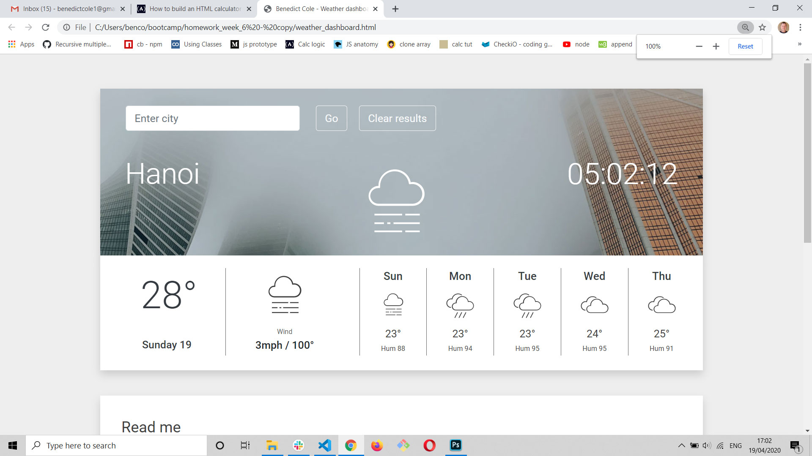

# Weather Dashboard

This weather dashboard uses two seperate APIs from OpenWeather to deliver a current forecast and a five day forecast for over 200,000 cities worldwide.

The application launches with one city, selected at random from a list of 15 well known locations. You can enter any major city across the globe and retrieve weather data that is refeshed every 3 hours for the current forecast and every five hours for the 5 day forecast.

In addition to weather conditions including temperature, wind speed/direction and humidity, there is a clock that utilises the Luxon date and time library to return a time that accurate to the millisecond.

The dashboard has been designed inline with Google Material Design principles and features background images that correspond to local weather conditions. This add an additional layer of information to help you get a 'feel' for the weather locally, much like AccuWeather's RealFeel©.

## Technology

This project was built using:

- HTML 5, Bootstrap 4.4.1, and custom CSS
- JavaScript
- OpenWeather API
- Luxon date and time library

Link to project - https://benbugs.github.io/weather_dashboard/

